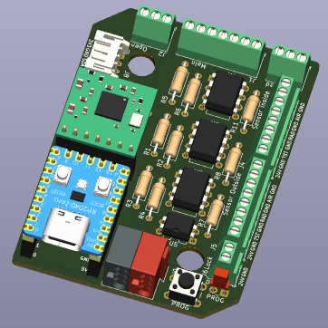
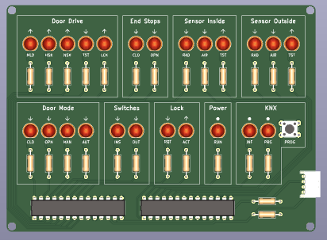

# OAM-DoorController

OpenKNX Firmware und Anwendung zur OpenKNX-kompatiblen Anbindung von elektrischen Türantrieben und Sensoren.

## Kompatible Türantriebe und Sensoren

Aktuell wird folgender Türantrieb unterstützt:
- dormakaba CS 80 Magneo

Zudem werden folgende Sensoren unterstützt:
- Öffnungs-/Absicherungssensor BEA IXIO-DT1
- Öffnungs-/Absicherungssensor BEA IXIO-DT3
- Absicherungssensor BEA IXIO ST

Weitere Türantriebe, auch anderer Hersteller, sowie Sensoren können bei Bedarf angebunden werden.

Es werden bis zu zwei Absicherungssensoren gleichzeitig zur Absicherung der Hauptschließkante (HSK) und Nebenschließkante (NSK) unterstützt.

Eine elektromagnetische Verriegelung (24 V) kann ebenfalls angeschlossen werden.

## Kompatible Hardware

Die OpenKNX-kompatible Anbindung erfolgt über eine Steuerplatine, an welcher der Türantrieb sowie etwaige Sensoren angeschlossen werden:

<kbd></kbd>

Diese Platine ist lediglich 7 x 5 cm groß und wird in der Nähe des Türantriebs montiert.

Zur Vereinfachten Inbetriebnahme und Fehlersuche kann zudem eine Erweiterungsplatine angeschlossen werden, welche den aktuellen Tür- und Sensorstatus direkt sichtbar anzeigt:

<kbd></kbd>

Diese wird im laufenden Betrieb der Türsteuerung nicht benötigt.

Bei Interesse an der Hardware oder Fragen zur Kompatibilität bestimmter Türantriebe/Sensoren bitte Kontakt über [E-Mail](mailto:info@ab-smarthouse.com?subject=[OpenKNX]%20DoorController) aufnehmen.